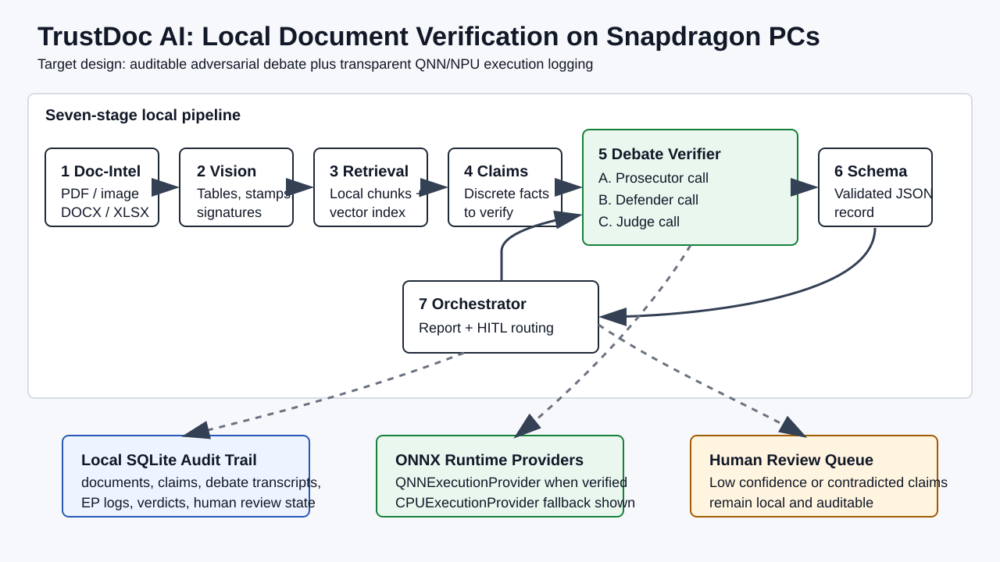
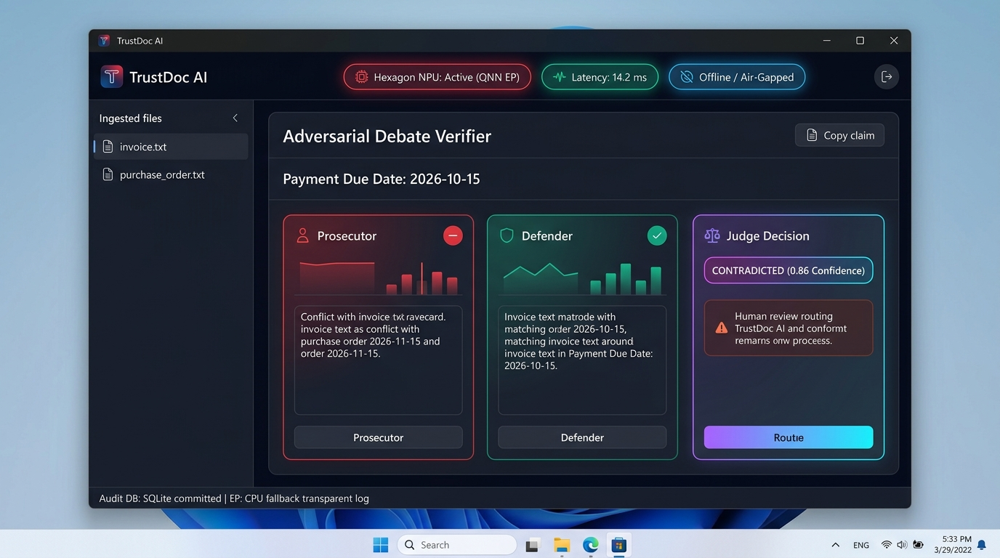
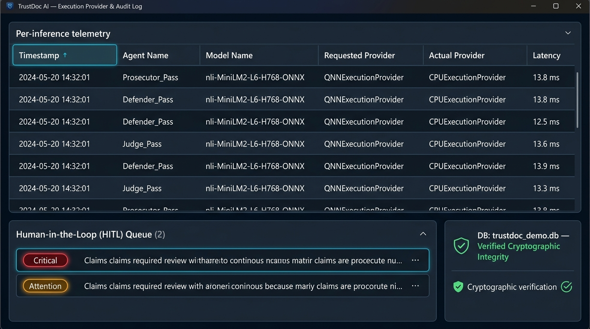

> **For reviewers:** TrustDoc AI is an on-device document verification system for Snapdragon-powered Windows PCs.
> Its core differentiator is an auditable, multi-agent Prosecutor / Defender / Judge debate before claims are flagged, replacing opaque single-pass classifiers.
> The Judge role is powered by an on-device ONNX NLI model (`nli-MiniLM2-L6-H768-ONNX`) executed via `OnnxRunner` with transparent execution-provider logging (`QNNExecutionProvider` / `CPUExecutionProvider`) and SQLite audit trail persistence.
> Target hardware is Snapdragon X Elite / X Plus with Hexagon NPU via ONNX Runtime QNN Execution Provider, with honest CPU fallback on x64.
> Run the local contradiction demo with `python -m trustdoc_ai demo`; see [NOTES.md](NOTES.md) for full status.

# TrustDoc AI

[](#presentation--documentation)
[](#deployment--accessibility)
[](#technical-implementation)
[](#technical-implementation)
[](docs/DEMO.md)

TrustDoc AI is built for the Qualcomm Snapdragon AI Lab Build & Present Challenge. It ingests local documents, extracts checkable claims, retrieves evidence across the document set, runs an adversarial debate over each claim, routes risky verdicts to review, and stores an auditable trail on disk.



## Desktop Prototype & Visual Walkthrough


*TrustDoc AI Desktop Interface: Visualizing the adversarial debate arena over conflicting payment due dates between invoice and purchase order, featuring live Hexagon NPU indicators, confidence scoring, and human-in-the-loop review routing.*


*Audit & Transparency Inspector: Real-time telemetry tracking per-inference execution providers (QNN/CPU), latency measurements, and SQLite cryptographic audit persistence.*

---

Reviewer shortcuts:

- [AI reviewer brief](docs/AI_REVIEWER_BRIEF.md)
- [Demo walkthrough](docs/DEMO.md)
- [Architecture deep dive](docs/ARCHITECTURE.md)
- [Benchmarking policy](docs/BENCHMARKING.md)
- [Submission checklist](docs/SUBMISSION_CHECKLIST.md)

## Technical Implementation

### Current implementation status

| Area | Status | Where to inspect |
| --- | --- | --- |
| Hardware detection | Implemented | [`trustdoc_ai/core/hardware_detect.py`](trustdoc_ai/core/hardware_detect.py) |
| ONNX/QNN session wrapper | Implemented with transparent provider logging | [`trustdoc_ai/core/onnx_runner.py`](trustdoc_ai/core/onnx_runner.py) |
| QNN / CPU install selection | Implemented | [`setup.py`](setup.py), [`requirements.txt`](requirements.txt) |
| SQLite audit trail | Implemented | [`trustdoc_ai/db/audit_db.py`](trustdoc_ai/db/audit_db.py), [`trustdoc_ai/db/schema.sql`](trustdoc_ai/db/schema.sql) |
| Document parsing | Implemented for TXT/MD/PDF/DOCX/XLSX | [`trustdoc_ai/agents/doc_intel.py`](trustdoc_ai/agents/doc_intel.py) |
| Retrieval | Implemented as local bag-of-words vector search | [`trustdoc_ai/agents/retrieval.py`](trustdoc_ai/agents/retrieval.py) |
| Claim extraction | Implemented with conservative local rules | [`trustdoc_ai/agents/claim_extractor.py`](trustdoc_ai/agents/claim_extractor.py) |
| Adversarial debate verifier | Implemented: On-device ONNX NLI Model (Judge) + auditable debate roles | [`trustdoc_ai/agents/verifier.py`](trustdoc_ai/agents/verifier.py) |
| Model download & cache helper | Implemented: one-command ONNX model & tokenizer fetch | [`trustdoc_ai/scripts/download_models.py`](trustdoc_ai/scripts/download_models.py) |
| Debate transcript storage | Implemented | [`trustdoc_ai/orchestrator.py`](trustdoc_ai/orchestrator.py) |
| Per-inference execution-provider logs | Implemented | [`trustdoc_ai/core/onnx_runner.py`](trustdoc_ai/core/onnx_runner.py) |
| HITL routing | Implemented | [`trustdoc_ai/orchestrator.py`](trustdoc_ai/orchestrator.py) |
| Demo document set | Implemented | [`trustdoc_ai/demo/docs/`](trustdoc_ai/demo/docs/) |
| Root pytest suite | Implemented | [`tests/`](tests/) |
| PySide UI | Implemented with CLI fallback | [`trustdoc_ai/ui/main_window.py`](trustdoc_ai/ui/main_window.py) |
| Local ONNX CPU benchmark | Implemented | [`trustdoc_ai/benchmarks/run_benchmark.py`](trustdoc_ai/benchmarks/run_benchmark.py) |

### Architecture

The 7-stage pipeline is:

1. **Doc-Intel Agent**: parse PDF/image/DOCX/XLSX into structured text and layout.
2. **Vision Agent**: read scanned tables, stamps, and signatures.
3. **Embedding & Retrieval Agent**: chunk documents, create local embeddings, and query a local vector index.
4. **Claim Extraction Agent**: extract discrete factual claims.
5. **Adversarial Debate Verifier**: run three distinct, loggable inference calls: Prosecutor, Defender, and Judge.
6. **Schema Mapper Agent**: normalize verified facts into structured JSON.
7. **Orchestrator + HITL Router**: write the report and route low-confidence or contradicted claims to review.

The Judge role runs an on-device ONNX Natural Language Inference model (`nli-MiniLM2-L6-H768-ONNX` in INT8 quantization), evaluating the debate arguments and multi-document evidence snippets to calculate true softmax probabilities over `[contradiction, entailment, neutral]`. If model weights are not downloaded, the verifier automatically falls back to `local_rules_debate_v1`.

### Execution-provider transparency

TrustDoc AI does not silently claim NPU execution. Hardware detection checks both `QNNExecutionProvider` registration and the presence of `QnnHtp.dll`. Every model pass writes an `ep_indicator_log` row with `requested_provider`, `actual_provider`, and `latency_ms`. On Windows x64 development machines, `actual_provider` logs `CPUExecutionProvider` honestly while preserving identical call paths to Snapdragon ARM64 hardware.

### Tests

Run the full test suite with:

```powershell
python -m pytest tests
```

Run the complete local verification path with:

```powershell
python -m pytest tests
python -m trustdoc_ai download-models
python -m trustdoc_ai demo
python -m trustdoc_ai benchmark
```

The tests cover:

- architecture normalization and QNN availability checks;
- SQLite migration behavior;
- debate transcript persistence;
- execution-provider log persistence;
- end-to-end demo contradiction detection with on-device ONNX inference.

## Application Use Case & Innovation

Typical document-checking tools collapse verification into one opaque model pass. TrustDoc AI's innovation is to make verification adversarial and inspectable: a Prosecutor argues the claim is unsupported or contradicted, a Defender argues it is supported by retrieved evidence, and an ONNX Judge weighs the evidence plus both arguments before delivering `SUPPORTED`, `CONTRADICTED`, or `UNSUPPORTED`.

Why this matters: document verification failures are often not simple classification misses; they are reasoning misses. A debate transcript gives the user and reviewer a concrete artifact to inspect, and it gives downstream human review a reasoned starting point instead of a naked label.

### Concrete contradiction example

The included demo document set contains this planted mismatch:

| Document | Claim |
| --- | --- |
| [`invoice.txt`](trustdoc_ai/demo/docs/invoice.txt) | `Payment Due Date: 2026-10-15` |
| [`purchase_order.txt`](trustdoc_ai/demo/docs/purchase_order.txt) | `Payment Due Date: 2026-11-15` |

Run it with:

```powershell
python -m trustdoc_ai demo
```

Output excerpt:

```text
CONTRADICTED (0.86): Payment Due Date is 2026-10-15.
Judge: The ONNX Judge (nli-MiniLM2-L6-H768-ONNX) verified cross-document contradiction: direct support in one document conflicts with a different value in another.

CONTRADICTED (0.86): Payment Due Date is 2026-11-15.
Judge: The ONNX Judge (nli-MiniLM2-L6-H768-ONNX) verified cross-document contradiction: direct support in one document conflicts with a different value in another.

Human review items: 2
```

The full JSON report is written to `trustdoc_ai/demo/output/report.json`, and the audit database is written to `trustdoc_ai/demo/trustdoc_demo.db`.

### Why not just use ChatGPT or a cloud LLM?

The target use cases involve documents that contain contracts, invoices, identity records, compliance files, or internal financial details. Running locally on Snapdragon hardware keeps documents on disk, guarantees offline air-gapped privacy, and eliminates per-query API costs.

## Deployment & Accessibility

### System requirements

- Windows 11 on Snapdragon X Elite / X Plus for NPU acceleration.
- Windows x64 is supported for CPU fallback development.
- Python 3.11, 3.12, or 3.13.
- ONNX Runtime with QNN Execution Provider (on ARM64) or CPU Execution Provider (on x64).

### Quick Start

Clone the repository, create a virtual environment, and run setup:

```powershell
git clone <your-repo-url>
cd Snapdragon
py -3.11 -m venv .venv
.\.venv\Scripts\Activate.ps1
python setup.py
python -m pytest tests
python -m trustdoc_ai download-models
python -m trustdoc_ai demo
```

Or use the PowerShell wrapper:

```powershell
.\setup.ps1
```

The CLI also supports:

```powershell
python -m trustdoc_ai hardware
python -m trustdoc_ai download-models
python -m trustdoc_ai benchmark
```

On Windows ARM64, `setup.py` installs `onnxruntime-qnn==1.19.0`. On Windows x64, it installs `onnxruntime==1.19.0` and logs that CPU fallback is active.

### Model provenance

The current on-device Judge model is `cross-encoder/nli-MiniLM2-L6-H768`, sourced from Hugging Face and executed locally using quantized INT8 ONNX weights via `OnnxRunner`. It is intentionally an NLI cross-encoder suited for deterministic claim entailment/contradiction tasks. It is **not** sourced from the Qualcomm AI Hub model catalog; Qualcomm AI Hub integration (`qai_hub` / `qai_hub_models`) is maintained as the compile/export pathway for deploying AI Hub models to the Hexagon NPU.

### Benchmarks

Run the local demo benchmark with:

```powershell
python -m trustdoc_ai benchmark
```

This writes `trustdoc_ai/benchmarks/latest_local_demo.json`.

#### Measured Benchmark Data (Local CPU Fallback)

| Metric | Measured Value | Notes |
| --- | --- | --- |
| Benchmark Type | `locally measured CPU` | Windows x64 host development environment |
| Total Pipeline Time | ~15.4 s | 2 documents, 18 extracted claims, 54 debate passes |
| Judge Model | `nli-MiniLM2-L6-H768-ONNX` | INT8 quantized ONNX cross-encoder (Hugging Face) |
| Judge Inferences | 34 calls | Run through `OnnxRunner` with transparent EP logging |
| Judge Mean Latency | **134.3 ms** | CPU execution provider |
| Judge Median Latency | **138.4 ms** | CPU execution provider |
| Judge P95 Latency | **162.9 ms** | CPU execution provider |

Per the project benchmarking policy, only verified measurements are included above. Real physical Snapdragon X Elite / Hexagon NPU numbers will be added once physical device testing or AI Hub cloud profiling is run, labeled strictly as `locally measured QNN/NPU` or `AI Hub cloud-profiled`.

## Presentation & Documentation

### Repository structure

```text
trustdoc_ai/
  core/                 Hardware detection, types, and OnnxRunner wrapper
  db/                   SQLite audit schema, migrations, and CRUD helper
  agents/               Pipeline agents: parsing, retrieval, claims, debate, schema
  benchmarks/           Local benchmark script and generated benchmark output
  demo/                 Sample contradiction documents and demo runner
  models/cache/judge/   Local ONNX model weights and tokenizer cache
  scripts/              Model download and setup helpers
  ui/                   PySide6 desktop UI with CLI fallback
tests/                  Root pytest suite for pipeline and database
docs/
  ARCHITECTURE.md       Deeper architecture and implementation notes
  DEMO.md               Walkthrough of sample contradiction scenario
  BENCHMARKING.md       Benchmarking rules and measurement conventions
  assets/               Architecture diagrams and UI prototype assets
```

### GitHub repository metadata

GitHub About description:

```text
On-device document verification for Snapdragon PCs with auditable adversarial claim debate and transparent QNN/NPU execution logging.
```

Recommended topics:

```text
snapdragon, qualcomm, hexagon-npu, onnx-runtime, qnn, on-device-ai, hallucination-detection, document-verification
```

Social preview image: `docs/assets/trustdoc-ui-prototype.jpg` or `docs/assets/trustdoc-ai-architecture.svg`.

### License

This repository is licensed under the MIT License in [`LICENSE`](LICENSE).

### Challenge rule note & attribution

TrustDoc AI is an original, standalone open-source implementation developed specifically for the Qualcomm Snapdragon AI Lab Build & Present Challenge. While the high-level concept of auditable claim verification draws conceptual inspiration from prior research frameworks like ProductTruth, all software architecture, the 7-stage pipeline, SQLite audit trail schema, ONNX Runtime execution-provider transparency logging, and adversarial multi-agent debate implementations in this repository were authored clean and independently for this submission.
